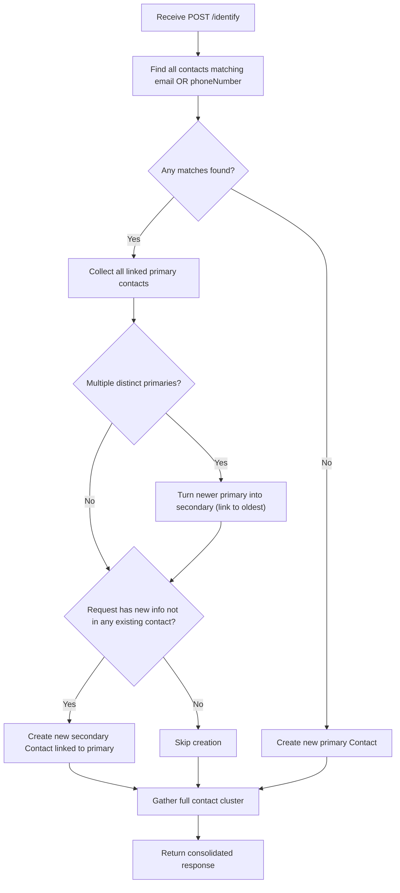

# Bitespeed Identity Reconciliation Service

## Tech Stack

- **Runtime:** Node.js with TypeScript
- **Framework:** Express.js
- **ORM:** Prisma
- **Database:** SQLite (local dev, easy to swap for PostgreSQL on deployment)
- **Hosting-ready:** Deployable to Render.com (free tier)

## Project Structure

```
projectpp/
  src/
    index.ts          # Express app entry point, starts server
    routes/
      identify.ts     # POST /identify route handler
    services/
      contact.service.ts  # Core identity reconciliation logic
  prisma/
    schema.prisma     # Contact model definition
  package.json
  tsconfig.json
  .gitignore
  README.md           # Setup instructions + hosted endpoint URL
```

## Database Schema (Prisma)

```prisma
model Contact {
  id              Int       @id @default(autoincrement())
  phoneNumber     String?
  email           String?
  linkedId        Int?
  linkPrecedence  String    // "primary" | "secondary"
  createdAt       DateTime  @default(now())
  updatedAt       DateTime  @updatedAt
  deletedAt       DateTime?
}
```

## Core Logic: `/identify` Endpoint

The `/identify` POST endpoint receives `{ email?, phoneNumber? }` and performs identity reconciliation:




### Detailed Algorithm (in `contact.service.ts`)

1. **Find matches:** Query all contacts where `email = input.email` OR `phoneNumber = input.phoneNumber` (only non-null inputs).
2. **Resolve primary IDs:** For each matched contact, find its root primary (follow `linkedId` chain). Collect unique primary IDs.
3. **Merge primaries if needed:** If there are 2+ distinct primaries, keep the oldest (by `createdAt`) as primary. Update all others to `linkPrecedence = "secondary"` with `linkedId` pointing to the oldest. Also re-link their secondaries.
4. **Create secondary if new info:** If the request contains an email or phone not present in any existing contact in the cluster, create a new secondary contact linked to the primary.
5. **Build response:** Fetch all contacts in the cluster (primary + all secondaries). Return consolidated JSON with primary's email/phone first, followed by unique emails and phones from secondaries.

### Response Format

```json
{
  "contact": {
    "primaryContatctId": 11,
    "emails": ["george@hillvalley.edu", "biffsucks@hillvalley.edu"],
    "phoneNumbers": ["919191", "717171"],
    "secondaryContactIds": [27]
  }
}
```

## Files to Create

1. `**package.json**` -- Dependencies: `express`, `@prisma/client`, `prisma`, `typescript`, `ts-node`, `@types/express`, `@types/node`. Scripts: `build`, `start`, `dev`, `prisma:migrate`.
2. `**tsconfig.json**` -- Target ES2020, strict mode, outDir `dist`.
3. `**prisma/schema.prisma**` -- Contact model with SQLite datasource.
4. `**src/index.ts**` -- Express app setup, JSON body parser, mount `/identify` route, listen on `process.env.PORT || 3000`.
5. `**src/routes/identify.ts**` -- Validate request body (at least one of email/phoneNumber), call service, return response.
6. `**src/services/contact.service.ts**` -- Full reconciliation logic as described above.
7. `**.gitignore**` -- node_modules, dist, .env, prisma/*.db.
8. `**README.md`** -- Project description, setup/run instructions, hosted endpoint URL placeholder.

## How to Run (will be documented in README)

```bash
# 1. Install dependencies
npm install

# 2. Generate Prisma client and run migrations
npx prisma migrate dev --name init

# 3. Run in development mode
npm run dev

# 4. Or build and run in production
npm run build
npm start
```

The server will start on `http://localhost:3000`. Test with:

```bash
curl -X POST http://localhost:3000/identify \
  -H "Content-Type: application/json" \
  -d '{"email": "test@example.com", "phoneNumber": "12345"}'
```

